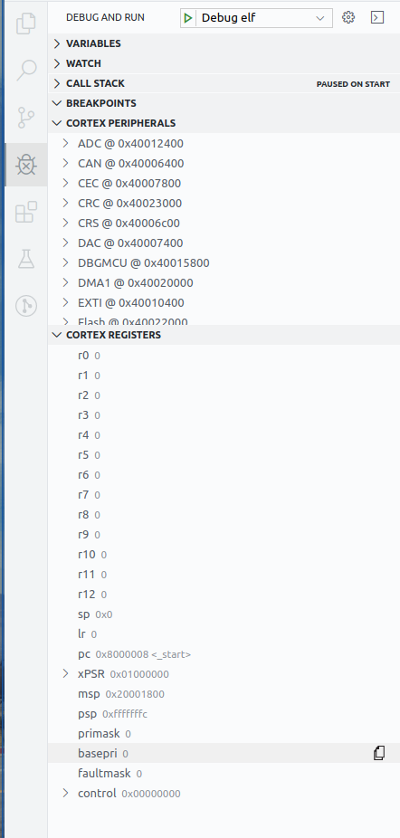

# Nucleo F042k6 Debugging mit Visual Studio Code unter Ubuntu 19.10

## Vorraussetzung

* Ubuntu 19.10
* Visual Studio Code
    * Cortex Debug Extension
* OpenOCD
* ARM GCC Toolchain (https://developer.arm.com/open-source/gnu-toolchain/gnu-rm/downloads) - gdb-multiarch funktioniert nicht!
* Python 3

## SVD Dateien

Die System View Descriptor Dateien für den MCU gibt es auf der STM32 Webseite unter Resources -> `HW Model, CAD Libraries & SVD` https://www.st.com/en/microcontrollers-microprocessors/stm32f042k6.html

Diese beschreiben den kompletten MCU als XML Datei - alle Register, Peripherals mit Registern etc. pp.

## pysvd zum erstellen lesbarer Übersichten

Mit dem python Tool `pysvd` bzw. `svd2rst` https://github.com/bfueldner/pysvd lassen sich lesbare Zusammenfassungen in reStructuredText (ähnlich Markdown) Format aus SVD Dateien generieren. Die Verwendung ist z.B. `svd2rst --svd STM32F0x2.svd --output STM32F0x2.rst`

## Wie verwende ich dieses Projekt?

```
.
├── .gitignore
├── .vscode
│  ├── launch.json  # Alle Debug Ziele von VSCode
│  └── tasks.json   # Alle Tasks die VSCode ausführen kann
├── cortex.S        # Assembler
├── makefile        # Makefile
├── nucleo-f0.cfg   # OpenOCD Skript
├── Readme.md
├── STM32F0x2.rst   # Lesbare Beschreibung des STM32F042 MCU
└── svd             # SVD Dateien von STM32 für die STM32F0x MCU-Familie
   ├── STM32F0x0.svd
   ├── STM32F0x1.svd
   ├── STM32F0x2.svd
   └── STM32F0x8.svd
```

In `launch.json` werden Debug Ziele definiert - in diesem Beispiel `Debug elf` welches die binary `cortex.elf` debuggt die wir erstellen. Vor dem Start muss nur noch der Pfad zum `bin` Verzeichnis zur GCC Toolchain unter `armToolchainPath` angegeben werden. Am besten einen absoluten Pfad verwenden z.B. `/home/user/gcc-arm-none-eabi/bin`.

Im `task.json` ist der Task `make elf` definiert der vor jedem Start des Debuggers aufgerufen wird. Dieser Task ruft einfach nur `make cortex.elf` in unserem Arbeitsverzeichnis auf. Wenn die Binary nicht nicht cortex.elf heißen soll müssen die Dateien makefile, launch.json und task.json angepasst werden!

Zum Debuggen eine Debugging Session über `Debug -> Debug elf` diese starten! Nicht vergessen das Debugsymbole bei Übersetzten hinzugefügt werden müssen. Breakpoints können einfach im Quelltext gesetzt werden. Die Register und Peripherals können jederzeit unter den entsprechenden Reitern angeschaut werden.

Elf Binarys welche aus C-Quellcode erstellt werden können genauso debuggt werden, so lange beim Übersetzen Debugging Symbole in der Elf Binary hinterlegt werden.

